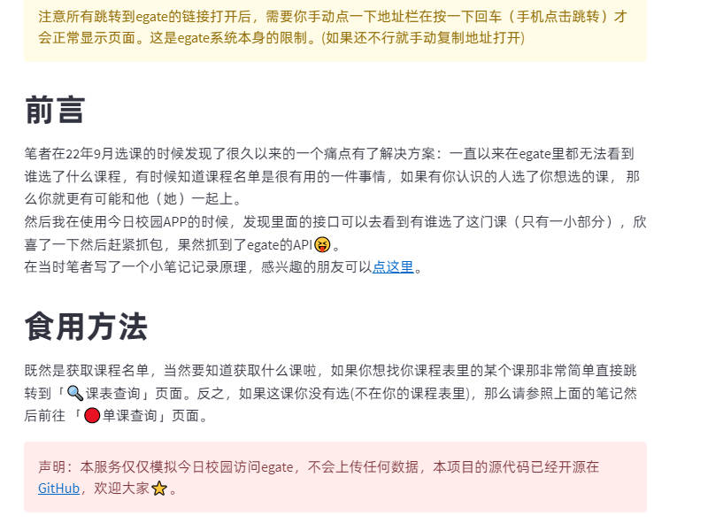
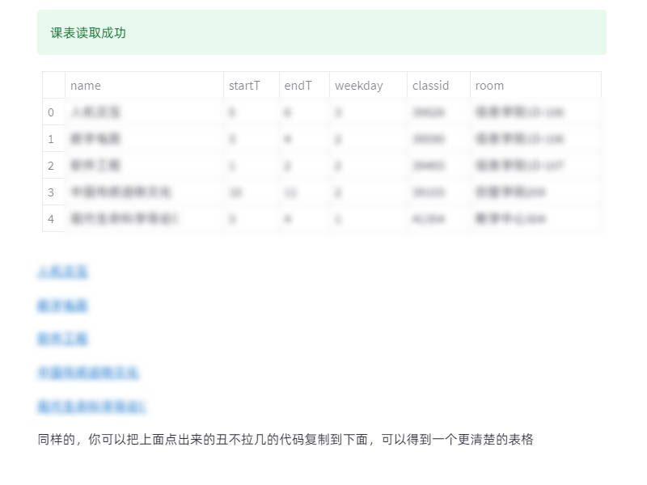
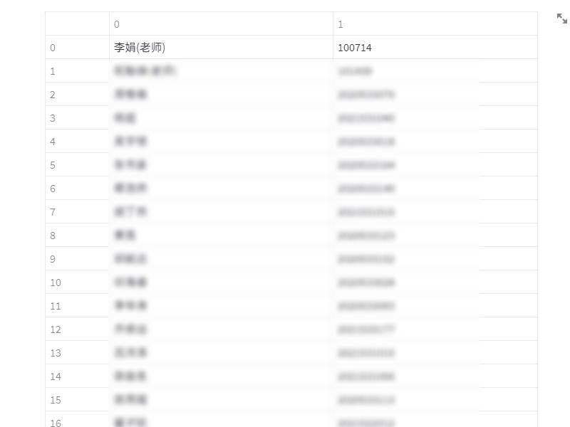
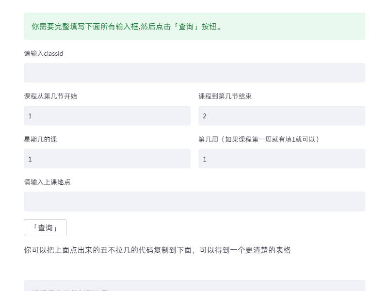

# 某科大选课名单查询工具
## 前言
笔者在22年9月选课的时候发现了很久以来的一个痛点有了解决方案：一直以来在egate里都无法看到谁选了什么课程，有时候知道课程名单是很有用的一件事情，如果有你认识的人选了你想选的课， 那么你就更有可能和他（她）一起上。

然后我在使用今日校园APP的时候，发现里面的接口可以去看到有谁选了这门课（只有一小部分），欣喜了一下然后赶紧抓包，果然抓到了egate的API😝。

在当时笔者写了一个小笔记记录原理，感兴趣的朋友可以[点这里](https://flowus.cn/share/105777d6-200e-460f-8c4d-7db16599dab9)。

## 工具地址
https://shanghaitech-choosecourse-query-production.up.railway.app/

## 效果截图

## TODO

- [ ] 编写Dockerfile  
